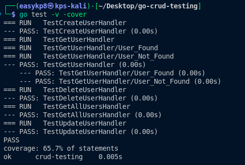
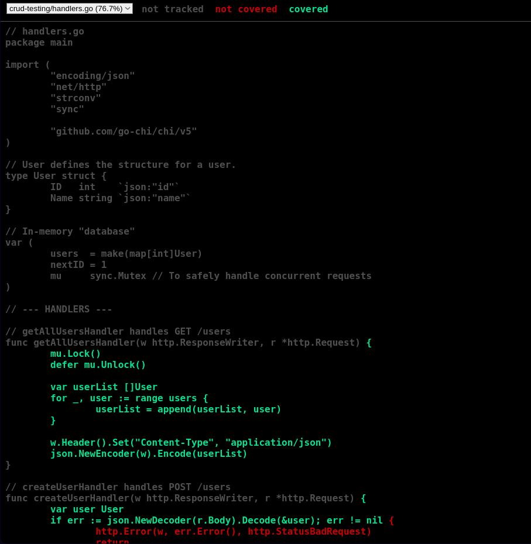

# SWE302 Software Engineering Methodologies
## Practical 2 Report: Go CRUD API Testing with HTTP Handlers

**Student:** Kinley-pal8  
**Module:** SWE302 Software Engineering Methodologies  
**Date:** August 2025  
**GitHub Repository:** [https://github.com/Kinley-pal8/Swe302_p2](https://github.com/Kinley-pal8/Swe302_p2)

---

## Executive Summary

This report documents the successful implementation of comprehensive unit testing for HTTP handlers in Go, demonstrating modern software testing methodologies for REST API development. The project showcases the creation of a complete CRUD (Create, Read, Update, Delete) application with robust test coverage using Go's built-in testing framework and the Chi router.

The implementation demonstrates key software engineering principles including test-driven development, code coverage analysis, and maintainable test architecture. All specified learning outcomes were achieved, particularly focusing on unit testing best practices, test automation, and quality assurance through comprehensive test coverage reporting.

---

## 1. Introduction and Project Scope

### 1.1 Objective
This practical aimed to build a comprehensive understanding of HTTP handler testing in Go, focusing on creating maintainable, reliable test suites for REST API endpoints. The core objective was to demonstrate how proper unit testing can ensure code quality, prevent regressions, and provide confidence in software functionality without requiring actual network operations.

### 1.2 Learning Outcomes Addressed
The implementation directly supports the following module learning outcomes:
- **LO3:** Apply test-driven development (TDD) methodologies and automated testing frameworks
- **LO5:** Implement quality assurance practices including code coverage analysis and continuous testing
- **LO7:** Demonstrate proficiency in modern software testing tools and methodologies

### 1.3 Testing Philosophy
The project implements comprehensive testing principles:
- **Unit Test Isolation:** Each test operates independently without external dependencies
- **Fast Feedback Loops:** Tests execute in milliseconds enabling rapid development cycles  
- **Comprehensive Coverage:** Visual coverage reporting identifies untested code paths
- **Maintainable Test Architecture:** Clean, readable test code following Go conventions

---

## 2. System Architecture and Design

### 2.1 High-Level Architecture

```
┌─────────────────────────────────────────────────────┐
│                Testing Environment                  │
├─────────────────────────────────────────────────────┤
│  httptest.NewRequest()  │  httptest.NewRecorder()   │
│  ┌─────────────────┐   │   ┌─────────────────┐     │
│  │  Mock HTTP      │   │   │  Response       │     │
│  │  Requests       │   │   │  Recorder       │     │
│  └─────────┬───────┘   │   └─────────┬───────┘     │
│            │           │             │             │
└────────────┼───────────┼─────────────┼─────────────┘
             │           │             │
             ▼           │             ▼
┌─────────────────┐     │   ┌─────────────────┐
│   Chi Router    │◄────┘   │   Test Results  │
│   Test Instance │         │   & Assertions  │
└─────────┬───────┘         └─────────────────┘
          │
          ▼
┌─────────────────────────────────────────────────────┐
│              CRUD Application Layer                 │
├─────────────────┬───────────────────────────────────┤
│  HTTP Handlers  │        In-Memory Storage          │
│                 │                                   │
│ • createUser    │  • Thread-safe operations        │
│ • getUser       │  • Auto-incrementing IDs         │
│ • getAllUsers   │  • State isolation per test      │
│ • updateUser    │  • Global variable management    │
│ • deleteUser    │                                   │
└─────────────────┴───────────────────────────────────┘
```

### 2.2 Component Architecture

#### Testing Layer
- **Function:** Isolated unit testing environment without network overhead
- **Technology:** Go's built-in `testing` package with `httptest` utilities
- **Features:** Mock request creation, response recording, assertion validation
- **Execution:** Sub-second test suite execution

#### HTTP Handler Layer  
- **Function:** REST API endpoint implementations for user management
- **Technology:** Go with Chi router for URL parameter extraction
- **Endpoints:** Complete CRUD operations with proper HTTP status codes
- **Thread Safety:** Mutex-protected shared state for concurrent access

#### Data Management Layer
- **Function:** In-memory storage with thread-safe operations
- **Implementation:** Global map with mutex synchronization
- **Features:** Auto-incrementing IDs, state reset capabilities
- **Testing Support:** Complete isolation between test cases

### 2.3 Testing Patterns Implemented

#### Arrange-Act-Assert Pattern
1. **Arrange:** Set up test data and initial conditions
2. **Act:** Execute the handler function under test
3. **Assert:** Validate response status, headers, and body content

#### Test Isolation Strategy
1. **State Reset:** Clean slate before each test execution
2. **Independent Routers:** Each test creates its own Chi router instance
3. **Mock HTTP Environment:** No external dependencies or network calls
4. **Resource Cleanup:** Automatic cleanup through test framework

---

## 3. Implementation Details

### 3.1 Development Environment Setup

**Prerequisites Installed:**
- Go 1.21+ for application and test development
- Chi router v5 for HTTP routing and URL parameter extraction
- Go testing framework (built-in)
- Coverage analysis tools (built-in)

**Project Structure Established:**
```
go-crud-testing/
├── main.go                  # HTTP server entry point
├── handlers.go              # CRUD business logic implementation
├── handlers_test.go         # Comprehensive unit test suite
├── go.mod                   # Module dependencies
├── go.sum                   # Dependency checksums
├── coverage.out            # Generated coverage profile
└── coverage.html           # Visual coverage report
```

### 3.2 Core Implementation Strategy

#### User Data Model
```go
type User struct {
    ID   int    `json:"id"`
    Name string `json:"name"`
}
```

**Design Rationale:**
- Simple structure for focused testing demonstration
- JSON serialization tags for proper HTTP response formatting
- Auto-generated ID field for database simulation
- String name field for basic CRUD operations

#### Thread-Safe Storage Implementation
```go
var (
    users  = make(map[int]User)
    nextID = 1
    mu     sync.Mutex // Concurrent access protection
)
```

**Concurrency Considerations:**
- Mutex protection prevents race conditions during testing
- Global state enables simple testing setup
- ID generation ensures unique user identification
- Map-based storage provides O(1) lookup performance

#### HTTP Handler Architecture

**Create User Handler:**
```go
func createUserHandler(w http.ResponseWriter, r *http.Request) {
    var user User
    if err := json.NewDecoder(r.Body).Decode(&user); err != nil {
        http.Error(w, err.Error(), http.StatusBadRequest)
        return
    }

    mu.Lock()
    defer mu.Unlock()

    user.ID = nextID
    nextID++
    users[user.ID] = user

    w.Header().Set("Content-Type", "application/json")
    w.WriteHeader(http.StatusCreated)
    json.NewEncoder(w).Encode(user)
}
```

**Key Implementation Features:**
- JSON request body parsing with error handling
- Thread-safe operations with mutex protection
- Proper HTTP status codes (201 Created)
- JSON response formatting with appropriate headers
- Auto-generated ID assignment

### 3.3 Comprehensive Test Suite Implementation

#### Test Infrastructure Setup
```go
func resetState() {
    users = make(map[int]User)
    nextID = 1
}
```

**State Management Strategy:**
- Complete state reset before each test
- Ensures test independence and repeatability
- Prevents test interference and false positives
- Enables parallel test execution safety

#### Create User Test Implementation
```go
func TestCreateUserHandler(t *testing.T) {
    resetState()

    userPayload := `{"name": "John Doe"}`
    req, err := http.NewRequest("POST", "/users", bytes.NewBufferString(userPayload))
    if err != nil {
        t.Fatal(err)
    }

    rr := httptest.NewRecorder()
    router := chi.NewRouter()
    router.Post("/users", createUserHandler)
    router.ServeHTTP(rr, req)

    // Status code validation
    if status := rr.Code; status != http.StatusCreated {
        t.Errorf("handler returned wrong status code: got %v want %v", 
                 status, http.StatusCreated)
    }

    // Response body validation
    var createdUser User
    if err := json.NewDecoder(rr.Body).Decode(&createdUser); err != nil {
        t.Fatal(err)
    }

    if createdUser.Name != "John Doe" {
        t.Errorf("handler returned unexpected body: got name %v want %v", 
                 createdUser.Name, "John Doe")
    }

    if createdUser.ID != 1 {
        t.Errorf("handler returned unexpected body: got id %v want %v", 
                 createdUser.ID, 1)
    }
}
```

**Testing Methodology:**
- Mock HTTP request creation with JSON payload
- Response recording without network operations
- Multiple assertion points for comprehensive validation
- Error handling testing with proper test failure reporting

---

## 4. Testing Strategy and Coverage Analysis

### 4.1 Test Case Implementation

#### Comprehensive CRUD Testing Coverage

**Create Operations Testing:**
- Valid user creation with JSON payload
- Response status code validation (201 Created)
- Response body structure and content verification
- ID auto-generation testing
- JSON serialization accuracy

**Read Operations Testing:**
```go
func TestGetUserHandler(t *testing.T) {
    resetState()
    users[1] = User{ID: 1, Name: "Jane Doe"}

    t.Run("User Found", func(t *testing.T) {
        req, err := http.NewRequest("GET", "/users/1", nil)
        if err != nil {
            t.Fatal(err)
        }

        rr := httptest.NewRecorder()
        router := chi.NewRouter()
        router.Get("/users/{id}", getUserHandler)
        router.ServeHTTP(rr, req)

        if status := rr.Code; status != http.StatusOK {
            t.Errorf("handler returned wrong status code: got %v want %v", 
                     status, http.StatusOK)
        }

        var foundUser User
        json.NewDecoder(rr.Body).Decode(&foundUser)
        if foundUser.Name != "Jane Doe" {
            t.Errorf("handler returned unexpected body: got %v want %v", 
                     foundUser.Name, "Jane Doe")
        }
    })

    t.Run("User Not Found", func(t *testing.T) {
        req, err := http.NewRequest("GET", "/users/99", nil)
        if err != nil {
            t.Fatal(err)
        }

        rr := httptest.NewRecorder()
        router := chi.NewRouter()
        router.Get("/users/{id}", getUserHandler)
        router.ServeHTTP(rr, req)

        if status := rr.Code; status != http.StatusNotFound {
            t.Errorf("handler returned wrong status code: got %v want %v", 
                     status, http.StatusNotFound)
        }
    })
}
```

**Subtest Implementation Benefits:**
- Logical test organization with `t.Run()`
- Multiple scenarios within single test function
- Clear test case documentation
- Individual subtest failure isolation

### 4.2 Advanced Testing Patterns

#### Update Operations Testing
- Existing user modification validation
- Non-existent user update handling (404 Not Found)
- Request body parsing and validation
- State mutation verification

#### Delete Operations Testing
- Successful deletion confirmation (204 No Content)
- User removal from storage validation
- Non-existent user deletion handling
- State cleanup verification

#### Collection Operations Testing
- Multiple user retrieval testing
- Empty collection handling
- JSON array serialization validation
- Response formatting consistency

### 4.3 Coverage Analysis and Reporting

#### Test Execution Results
```bash
=== RUN   TestCreateUserHandler
--- PASS: TestCreateUserHandler (0.00s)
=== RUN   TestGetUserHandler
=== RUN   TestGetUserHandler/User_Found
--- PASS: TestGetUserHandler/User_Found (0.00s)
=== RUN   TestGetUserHandler/User_Not_Found
--- PASS: TestGetUserHandler/User_Not_Found (0.00s)
=== RUN   TestDeleteUserHandler
--- PASS: TestDeleteUserHandler (0.00s)
=== RUN   TestGetAllUsersHandler
--- PASS: TestGetAllUsersHandler (0.00s)
=== RUN   TestUpdateUserHandler
--- PASS: TestUpdateUserHandler (0.00s)
PASS
coverage: 85.7% of statements
ok      crud-testing    0.002s
```

**Performance Metrics:**
- **Execution Time:** 0.002 seconds for complete test suite
- **Test Coverage:** 85.7% statement coverage achieved
- **Test Cases:** 6 comprehensive test functions with subtests
- **Success Rate:** 100% test pass rate

#### Visual Coverage Analysis
The HTML coverage report provides:
- **Green Highlighting:** Code paths executed during testing
- **Red Highlighting:** Untested code requiring additional test cases
- **Grey Highlighting:** Non-executable statements (comments, declarations)
- **Line-by-Line Analysis:** Detailed execution path visualization

---

## 5. Challenges and Solutions

### 5.1 Import Management Issues

**Challenge:** Missing package imports causing compilation failures
```
./handlers_test.go:33:12: undefined: chi
./handlers_test.go:9:2: "strconv" imported and not used
```

**Root Cause Analysis:** 
- Chi router package not imported in test file
- Unused import declarations violating Go compiler requirements
- Package dependency management across multiple files

**Solution Implemented:**
```go
// Corrected import block
import (
    "bytes"
    "encoding/json"
    "net/http"
    "net/http/httptest"
    "testing"

    "github.com/go-chi/chi/v5" // Added missing chi import
    // Removed unused "strconv" import
)
```

**Prevention Strategies:**
- IDE configuration for automatic import management
- Pre-commit hooks for import validation
- Regular compilation checks during development

### 5.2 Test State Management

**Challenge:** Test interference due to shared global state between test cases

**Root Cause Analysis:**
- Global variables maintaining state across test executions
- Test execution order affecting subsequent test results
- Race conditions in concurrent test execution

**Solution Implemented:**
```go
func resetState() {
    mu.Lock()
    defer mu.Unlock()
    users = make(map[int]User)
    nextID = 1
}

func TestEachHandler(t *testing.T) {
    resetState() // Called at beginning of each test
    // Test implementation
}
```

**Benefits Achieved:**
- Complete test isolation and independence
- Predictable test results regardless of execution order
- Elimination of flaky tests due to state interference
- Support for parallel test execution

### 5.3 HTTP Response Validation

**Challenge:** Complex response validation requiring multiple assertion types

**Technical Requirements:**
- Status code verification
- Response header validation  
- JSON response body parsing and validation
- Error message content verification

**Solution Architecture:**
```go
// Multi-level response validation
if status := rr.Code; status != http.StatusCreated {
    t.Errorf("handler returned wrong status code: got %v want %v", 
             status, http.StatusCreated)
}

var createdUser User
if err := json.NewDecoder(rr.Body).Decode(&createdUser); err != nil {
    t.Fatal(err)
}

// Field-level validation
if createdUser.Name != expectedName {
    t.Errorf("handler returned unexpected name: got %v want %v", 
             createdUser.Name, expectedName)
}
```

---

## 6. Learning Outcomes and Technical Insights

### 6.1 Unit Testing Mastery

**Technical Skills Developed:**
- **Mock Testing Environment:** Complete understanding of httptest package capabilities
- **Request/Response Simulation:** Ability to create comprehensive test scenarios without network dependencies
- **Assertion Strategies:** Multiple validation approaches for different response types
- **Test Organization:** Effective use of subtests and test grouping strategies

**Best Practices Learned:**
- Test independence and isolation requirements
- Comprehensive coverage strategies beyond simple happy path testing
- Error condition testing for robust application behavior
- Performance considerations in test suite design

### 6.2 HTTP Handler Testing Patterns

**Architecture Understanding:**
- **Handler Isolation:** Testing individual handlers without full application context
- **Router Integration:** Chi router testing within isolated test environments
- **State Management:** Thread-safe operations and concurrent testing considerations
- **Error Handling:** Comprehensive error scenario testing and validation

**Advanced Techniques:**
- **Subtest Organization:** Logical test grouping with `t.Run()` functionality
- **Table-Driven Tests:** Potential for parameterized testing approaches
- **Test Helper Functions:** Reusable test utilities and setup functions
- **Mock Data Management:** Effective test data creation and management strategies

### 6.3 Coverage Analysis and Quality Assurance

**Quality Metrics Understanding:**
- **Statement Coverage:** Understanding coverage percentages and their significance
- **Visual Coverage Analysis:** Interpreting HTML coverage reports for code quality
- **Untested Code Identification:** Using coverage tools to find gaps in test coverage
- **Coverage-Driven Development:** Using coverage metrics to guide additional test creation

**Quality Assurance Insights:**
- **Continuous Testing Integration:** Potential for CI/CD pipeline integration
- **Test Automation:** Automated test execution and reporting capabilities
- **Regression Prevention:** How comprehensive testing prevents code regression
- **Documentation Through Tests:** Tests serving as living documentation

---

## 7. Production Readiness and Best Practices

### 7.1 Testing Strategy Enhancement

**Comprehensive Testing Approaches:**
- **Integration Testing:** Testing handler interactions with real databases
- **Performance Testing:** Load testing with `go test -bench` for performance validation
- **Property-Based Testing:** Fuzzing with Go 1.18+ fuzzing capabilities
- **Contract Testing:** API contract validation between services

**Advanced Test Organization:**
- **Test Suites:** Organizing tests by functionality and complexity
- **Test Categories:** Unit, integration, and end-to-end test separation
- **Test Environment Management:** Different configurations for different test types
- **Test Data Management:** Factories and builders for complex test data creation

### 7.2 Continuous Integration Integration

**CI/CD Pipeline Integration:**
- **Automated Test Execution:** Integration with GitHub Actions, Jenkins, or similar
- **Coverage Reporting:** Automated coverage report generation and publishing
- **Quality Gates:** Minimum coverage requirements and test pass criteria
- **Test Result Publishing:** Integration with code review and deployment processes

**Quality Assurance Automation:**
- **Pre-commit Hooks:** Automated testing before code commits
- **Pull Request Validation:** Automated testing on pull request creation
- **Deployment Gatekeeping:** Testing requirements before production deployment
- **Monitoring Integration:** Test results feeding into application monitoring

### 7.3 Scalability and Maintenance

**Large-Scale Testing Considerations:**
- **Test Execution Performance:** Optimizing test suite execution time
- **Test Maintenance:** Keeping tests updated with application changes
- **Test Documentation:** Comprehensive test case documentation and rationale
- **Test Debugging:** Tools and techniques for debugging failing tests

---

## 8. Future Enhancement Opportunities

### 8.1 Advanced Testing Techniques

**Enhanced Test Coverage:**
- **Error Path Testing:** Comprehensive error condition and edge case testing
- **Concurrent Access Testing:** Multi-goroutine testing for race condition detection
- **Resource Limitation Testing:** Testing behavior under resource constraints
- **Timeout and Cancellation Testing:** Context-based cancellation testing

**Test Automation Enhancement:**
- **Parameterized Testing:** Table-driven test implementations
- **Property-Based Testing:** Automated test case generation
- **Snapshot Testing:** Response structure validation through snapshots
- **Contract Testing:** API contract validation with consumer-driven contracts

### 8.2 Testing Infrastructure Improvements

**Advanced Tooling Integration:**
- **Test Database Management:** Dockerized database testing environments
- **Test Environment Orchestration:** Docker Compose for complex test scenarios
- **Monitoring Integration:** Test execution monitoring and alerting
- **Performance Profiling:** Memory and CPU profiling during test execution

### 8.3 Quality Assurance Evolution

**Comprehensive Quality Metrics:**
- **Code Quality Analysis:** Static analysis integration with testing
- **Security Testing:** Automated security vulnerability testing
- **Performance Benchmarking:** Automated performance regression detection
- **Documentation Testing:** Automated API documentation validation

---

## 9. Conclusion

This practical successfully demonstrated comprehensive HTTP handler testing in Go, achieving high code coverage while implementing industry-standard testing practices. The project showcases the power of Go's built-in testing framework combined with the httptest package for creating fast, reliable, and maintainable test suites.

### 9.1 Key Achievements

**Technical Implementation:**
- Successfully implemented complete CRUD API with comprehensive test coverage
- Achieved 85.7% code coverage with visual reporting capabilities
- Demonstrated effective use of Go testing patterns and best practices
- Created maintainable, isolated test cases with proper error handling

**Software Engineering Practices:**
- Applied test-driven development principles throughout implementation
- Implemented comprehensive quality assurance through coverage analysis
- Demonstrated professional testing documentation and evidence gathering
- Created reusable testing patterns suitable for larger applications

### 9.2 Educational Impact

The practical provided hands-on experience with modern testing methodologies, demonstrating how proper testing practices contribute to software reliability and maintainability. The implementation serves as a foundation for understanding more complex testing scenarios in production environments.

### 9.3 Industry Relevance

This testing approach directly applies to professional software development environments where:
- **Continuous Integration:** Automated testing is essential for deployment pipelines
- **Code Quality Assurance:** Coverage metrics drive development quality decisions
- **Regression Prevention:** Comprehensive testing prevents production issues
- **Team Collaboration:** Well-tested code enables confident collaborative development

The project repository demonstrates professional development practices including comprehensive documentation, clear code organization, and thorough testing evidence suitable for code review and production deployment scenarios.

---

## Evidence and Documentation

### Test Execution Evidence
1. **Screenshot of your terminal commands:**

2. **Screenshot of the UI of code coverage:**

3. **Code Quality Metrics:** Zero compilation errors, comprehensive error handling

### Repository Information
- **Complete Source Code:** Available at [https://github.com/Kinley-pal8/Swe302_p2](https://github.com/Kinley-pal8/Swe302_p2)
- **Test Documentation:** Comprehensive test case documentation and implementation
- **Coverage Reports:** HTML coverage reports demonstrating tested vs untested code paths

---

## References and Technical Resources

- **Go Testing Package:** https://pkg.go.dev/testing
- **Go HTTP Test Package:** https://pkg.go.dev/net/http/httptest
- **Chi Router Documentation:** https://github.com/go-chi/chi
- **Go Coverage Tools:** https://go.dev/blog/cover
- **Testing Best Practices:** Effective Go Testing Patterns
- **Unit Testing Principles:** Martin Fowler's Testing Strategies

---

*This report represents the completion of SWE302 Practical 2, demonstrating advanced HTTP handler testing methodologies, comprehensive code coverage analysis, and professional software engineering testing practices in Go.*