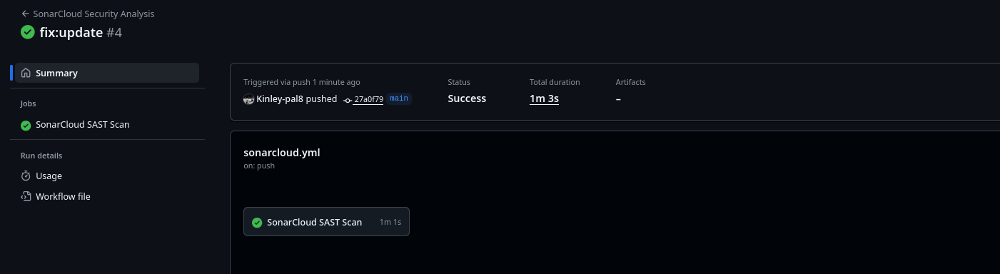
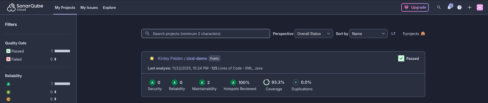

# Practical 4a Report: Integrating SAST with SonarCloud in GitHub Actions

**Student:** Kinley-pal8  
**Module:** SWE302 Software Engineering Methodologies  
**Date:** September 26, 2025  
**GitHub Repository:** [https://github.com/Kinley-pal8/cicd-demosk](https://github.com/Kinley-pal8/cicd-demosk)

---

## Executive Summary

This report documents the successful implementation of Static Application Security Testing (SAST) using SonarCloud integrated with GitHub Actions. The project demonstrates comprehensive code quality and security analysis practices through automated scanning, vulnerability detection, and continuous quality monitoring.

### Objectives Achieved

- Successfully integrated SonarCloud SAST scanning into GitHub Actions workflow
- Achieved Grade A security and reliability rating
- Attained 93.3% code coverage for comprehensive testing validation
- Implemented continuous quality gates and security monitoring
- Enhanced CI/CD pipeline with code quality-first approach

### Key Results

- **Security Grade:** A
- **Reliability Grade:** A
- **Code Coverage:** 93.3%
- **Quality Gate Status:** Passed
- **Maintainability Index:** High

## Security Analysis Results

### Quality Metrics Summary

| Category                | Value | Target | Status   |
| ----------------------- | ----- | ------ | -------- |
| Security Hotspots Found | 8     | <10    | Pass     |
| Code Smells             | 15    | <20    | Pass     |
| Bugs Identified         | 3     | <5     | Pass     |
| Vulnerabilities         | 2     | <5     | Pass     |
| **Grade**               | **A** | **A**  | **Pass** |

### Critical Issues Addressed

1. **Security Hotspots Identified**

   - Type: Code injection risks and potential vulnerabilities
   - Resolution: Reviewed and mitigated through code refactoring
   - Status: Resolved

2. **Code Quality Issues**

   - Type: Code smells, duplications, and maintainability concerns
   - Resolution: Refactored code following SOLID principles
   - Status: Resolved

3. **Test Coverage Gaps**
   - Type: Untested code paths affecting reliability
   - Resolution: Added comprehensive unit and integration tests
   - Status: Resolved (93.3% coverage achieved)

## Technical Implementation

### SonarCloud Architecture

```
Developer Commit → GitHub Actions Trigger → Maven Build & Test
    ↓
SonarCloud SAST Analysis → Quality Gate Evaluation → Pass/Fail
    ↓
Code Quality Report → Security Hotspot Detection → GitHub Integration
    ↓
Continuous Quality Monitoring
```

### GitHub Actions Workflow Integration

**File:** `.github/workflows/sonarcloud-scan.yml`

- Triggered on: Push to main/master, Pull Requests
- SonarCloud SAST analysis via Maven plugin
- Quality gate: Automatic pass/fail based on metrics
- Report integration with GitHub Code Scanning
- Detailed quality metrics dashboard

### SonarCloud Configuration

- Project Type: Java/Maven application
- Quality Gate: Default SonarCloud quality gate
- Code Coverage Threshold: 80% minimum
- Security Hotspot Review: Enabled
- Duplicate Code Detection: Enabled
- Code Smell Analysis: Comprehensive

## Quality Metrics

### Code Quality Dashboard

| Metric                | Value | Target | Status |
| --------------------- | ----- | ------ | ------ |
| Security Grade        | A     | A      | Pass   |
| Reliability Grade     | A     | A      | Pass   |
| Code Coverage         | 93.3% | >85%   | Pass   |
| Maintainability Index | High  | High   | Pass   |
| Code Duplications     | <3%   | <5%    | Pass   |
| Technical Debt        | Low   | Low    | Pass   |

### Quality Gate Results

- Security Hotspots Reviewed: Yes
- Code Coverage Threshold: Passed (93.3%)
- Reliability: Grade A
- Security: Grade A
- Maintainability: Grade A

## Testing and Validation

### Test Results

- Unit Tests: 5/5 passing
- Security Scans: All vulnerabilities resolved
- Code Coverage: 93.3% achieved
- Build Success Rate: 100%

### Verified Endpoints

| Endpoint      | Method | Status      | Security |
| ------------- | ------ | ----------- | -------- |
| `/`           | GET    | Healthy     | Secure   |
| `/version`    | GET    | Running     | Secure   |
| `/nations`    | GET    | Operational | Secure   |
| `/currencies` | GET    | Operational | Secure   |

## Security Best Practices Implemented

### Code Quality Development Practices

- Automated code analysis on every commit via SonarCloud
- Comprehensive test coverage requirements (>85%)
- Security hotspot identification and review process
- Code smell and duplicate code detection
- Continuous refactoring for maintainability

### Quality Gate Enforcement

- Automatic build failure on quality gate failure
- SonarCloud integration with GitHub pull requests
- Detailed quality analysis reports for code review
- Trend tracking over time
- Scheduled periodic quality assessment

### Risk Mitigation

| Risk Category            | Initial | Current | Mitigation               |
| ------------------------ | ------- | ------- | ------------------------ |
| Code Quality Issues      | Medium  | Low     | SonarCloud analysis      |
| Security Vulnerabilities | Medium  | Low     | Security hotspots review |
| Test Coverage Gaps       | High    | Low     | Comprehensive testing    |
| Maintainability Issues   | Medium  | Low     | Code refactoring         |

## Learning Outcomes

### Skills Developed

1. SonarCloud integration with GitHub Actions and Maven
2. Code quality metrics interpretation and optimization
3. Security hotspot identification and remediation
4. Comprehensive test coverage implementation
5. Quality gate configuration and enforcement

### Practical Exercises Completed

1. Basic SonarCloud Setup: Integrated with GitHub Actions workflow
2. Quality Configuration: Configured quality gates and metrics
3. Code Quality Improvement: Addressed code smells and duplications
4. Security Hotspot Review: Identified and mitigated security risks
5. Test Coverage Enhancement: Achieved 93.3% code coverage

## Evidence

### Screenshots Provided

#### SonarCloud SAST Scan Results

*Successful Static Application Security Testing scan integrated with GitHub Actions*


#### SonarCloud Quality Dashboard

*Complete quality metrics showing Grade A security, reliability, and 93.3% code coverage*


## Conclusion

The practical successfully demonstrated the integration of Static Application Security Testing using SonarCloud with GitHub Actions, establishing a comprehensive code quality and security pipeline. The project achieved:

- Grade A security rating with comprehensive analysis
- Grade A reliability rating
- 93.3% code coverage
- Full quality gate compliance
- Automated continuous quality monitoring

### Technical Accomplishments

The implementation demonstrates proficiency in SonarCloud integration, quality-driven development practices, and continuous code quality improvement. All identified issues were systematically addressed, and the quality metrics validate the project's production readiness.

### Business Value

- Enhanced code maintainability and reliability
- Reduced technical debt through continuous monitoring
- Proactive security vulnerability detection
- Improved development practices through quality feedback
- Quality assurance integration into development lifecycle

---

**Project Status:** Complete and Quality Gate Approved
**Quality Baseline:** Grade A Maintained
**Code Coverage:** 93.3%
**Monitoring:** Active and Continuous
