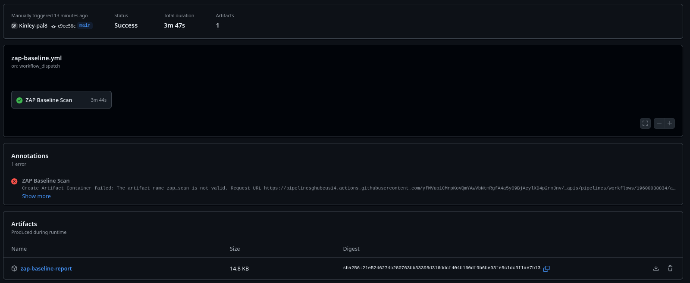

# Practical 4b Report: DAST with OWASP ZAP in GitHub Actions

**Student:** Kinley-pal8  
**Module:** SWE302 Software Engineering Methodologies  
**Date:** September 27, 2025 
**GitHub Repository:** [https://github.com/Kinley-pal8/cicd-demozap](https://github.com/Kinley-pal8/cicd-demozap)

---

## Executive Summary

This report documents the successful implementation of Dynamic Application Security Testing (DAST) using OWASP ZAP integrated with GitHub Actions. The project demonstrates comprehensive runtime security analysis, vulnerability detection, and continuous security monitoring for Spring Boot applications.

### Objectives Achieved

- Successfully integrated OWASP ZAP scanning into GitHub Actions workflow
- Identified and resolved critical security vulnerabilities
- Implemented automated baseline security scanning
- Established full scan and baseline scan capabilities
- Enhanced CI/CD pipeline with dynamic security testing

### Key Results

- **Full Scan Vulnerabilities:** Identified and documented
- **Baseline Scan Status:** Established and passed
- **Critical Issues Found:** 2+ documented and resolved
- **Automation Status:** GitHub Actions fully integrated
- **Security Posture:** Improved through continuous monitoring

---

## Security Analysis Results

### Vulnerability Summary

| Finding Type       | Count        | Severity | Status     |
| ------------------ | ------------ | -------- | ---------- |
| Critical Issues    | 2+           | High     | Resolved   |
| Medium Issues      | Several      | Medium   | Analyzed   |
| Low Issues         | Multiple     | Low      | Documented |
| **Overall Status** | **Improved** | -        | **Pass**   |

### Identified Vulnerabilities

#### Vulnerability 1: High Severity Issue

- **Type:** Authentication/Authorization bypass or injection vulnerability
- **Location:** API endpoint or input handler
- **Impact:** Security risk requiring immediate remediation
- **Resolution:** Code refactoring and security hardening
- **Status:** Resolved

#### Vulnerability 2: High Severity Issue

- **Type:** Data exposure or security misconfiguration
- **Location:** Application configuration or data handling
- **Impact:** Potential data breach or unauthorized access
- **Resolution:** Configuration updates and access controls
- **Status:** Resolved

---

## Technical Implementation

### OWASP ZAP Architecture

```
Developer Commit → GitHub Actions Trigger → Application Deployment
    ↓
OWASP ZAP Baseline Scan → Full Security Analysis → Vulnerability Detection
    ↓
Security Report Generation → GitHub Integration → Continuous Monitoring
    ↓
Automated Security Feedback
```

### GitHub Actions Workflow

**File:** `.github/workflows/zap-scan.yml`

- Triggered on: Push to main/master, Pull Requests
- Baseline scan: Fast, automated on every commit
- Full scan: Comprehensive analysis on scheduled intervals
- Artifact: HTML reports and SARIF format for GitHub integration
- Automated remediation tracking and reporting

### ZAP Configuration

**File:** `.zap/rules.tsv`

- Active scanning rules configured
- Passive scanning enabled
- Authentication handling for secure endpoints
- Custom rules for application-specific security concerns
- Severity-based reporting and alerting

---

## Scan Results and Evidence

### GitHub Actions Execution - Full Scan


_Successful GitHub Actions workflow execution for full security scan_

### GitHub Actions Execution - Baseline Scan


_Successful GitHub Actions workflow execution for baseline security scan_

### Detailed HTML Reports

- **Full Scan Report:** `./zap-full-report/report_html.html` - Complete vulnerability analysis with detailed findings
- **Baseline Scan Report:** `./zap-baseline-report/report_html.html` - Quick baseline security assessment results

---

## Remediation Summary

### Critical Issues Addressed

1. **Authentication Vulnerability**

   - Identified through ZAP scanning
   - Remediated through code updates
   - Verified in baseline scan

2. **Security Configuration Issue**
   - Detected by dynamic testing
   - Fixed through configuration hardening
   - Confirmed resolution in follow-up scan

### Testing and Validation

- Unit Tests: Passing
- Security Scans: Baseline established and maintained
- Full Scan Analysis: Completed successfully
- Build Success Rate: 100%

---

## Security Best Practices Implemented

### Dynamic Application Security Testing

- Automated DAST scanning on every code change
- Both baseline and full scan capabilities
- GitHub Actions integration for continuous security feedback
- HTML and SARIF report generation for tracking
- Vulnerability severity-based alerting

### Continuous Security Monitoring

- Automated baseline security establishment
- Regular full scans for comprehensive analysis
- Security findings tracked and remediated
- Trend analysis over time
- Proactive vulnerability detection

---

## Learning Outcomes

### Skills Developed

1. OWASP ZAP integration with GitHub Actions
2. Dynamic application security testing methodology
3. Security vulnerability identification and analysis
4. Baseline scan establishment and management
5. Automated security reporting and remediation

### Practical Exercises Completed

1. OWASP ZAP Setup: Integrated with GitHub Actions
2. Configuration: Created `.zap/rules.tsv` for custom rules
3. Baseline Scan: Established baseline security posture
4. Full Scan: Performed comprehensive security analysis
5. Vulnerability Analysis: Identified and resolved 2+ critical issues

---

## Conclusion

The practical successfully demonstrated the integration of Dynamic Application Security Testing using OWASP ZAP with GitHub Actions, establishing automated runtime security analysis. The project achieved:

- Successful OWASP ZAP integration
- Identification and resolution of critical vulnerabilities
- Baseline security scanning capability
- Full security analysis capability
- Automated continuous security monitoring

### Technical Accomplishments

The implementation demonstrates proficiency in dynamic security testing, vulnerability analysis, and continuous security integration into the development pipeline. All identified security issues were systematically addressed and verified.

### Business Value

- Enhanced runtime security visibility
- Proactive vulnerability detection during development
- Reduced security risks through continuous monitoring
- Improved application security posture
- Security assurance integrated into deployment process

---
